# About Design Principles
1. Generalized knowledge that helps to make design decisions
2. Proven conventions and best practices
## Objectives
1. Reduce unwanted complexity
2. Achieve quality requirements

### RULE 1 - Knnow when to break the rules
1. You, as an architect, are responsible and paid for the...
- fulfillment of the requirements
- solution to the problem at hand
2. Not for perfect adherence to principles
3. Principles can cantradict each other or specific requriments

# Important Design Principles
## Information Hiding
1. Encapsulating complexity in components to improve flexibility, stability, testability and understandibility
2. Treat components as Black boxes
   - Hide internal details from clients
   - No direct access to internal data and structures - access only via defined interfaces
   - Expose only what is needed, hide everything else
3. Breaking encapsulation leads to unwanted dependencies leading higher complexity


## Separation of Concerns (SoC)
1. Manage different problems separately - split complex systems according to their responsibilities
2. Separate concerns
   -  BUSINESS domain, sub-domains, sub-tasks...
   -  TECHNOLOGY persistence, business logic, behaviour, presentation...
   

## Modularity
1. SoC + Information Hiding = Modularity
2. Modules
   - Encapsulates responsibilities
   - Expose well defined interfaces only
   - Can be developed, maintained and tested independently
3. Ability to create more complex modules / systems from smaller modules
4. Ability to replace a module without any side-effects

## Loose Coupling
### Coupling
1. Degree or measure of how closely two components are connected.
2. It is an inherent property of each system - it is inevitable and necessary to create relationships (and dependencies) between components
3. With each dependency and relationship, complexity increases

#### Types of Coupling
How are components coupled to each other?
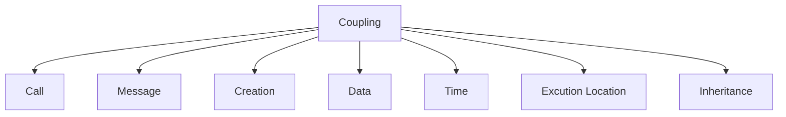
##### Call
Caller depends on Callee.
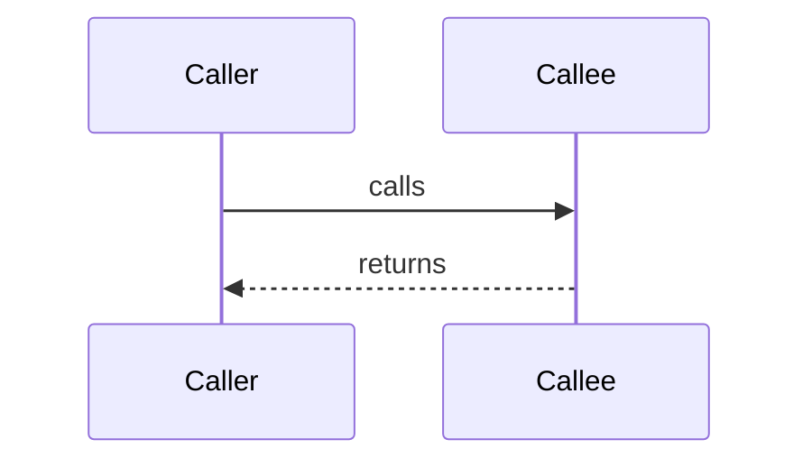
##### Message
More loosely coupled compared to call coupling because sender doesn't have to wait for any response from receiver. 
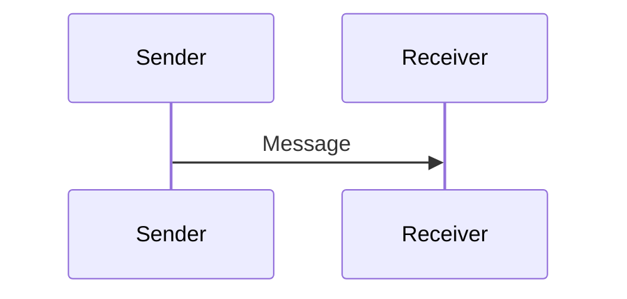
##### Creation
Creator depends on the class that it instantiates
`SomeClass createdObject = new SomeClass(10)`
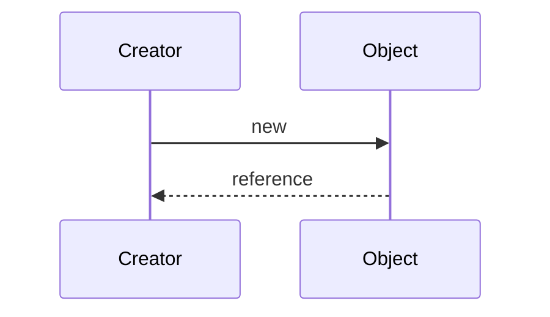
##### Data Structure
1. Clients can be 2 classes sharing data structures like Map / List. Or it can be 2 processes running on the same computer sharing memory / file. Or 2 services coupled to the same database
2. The shared datastructure creates 2-way indirect dependency between 2 clients
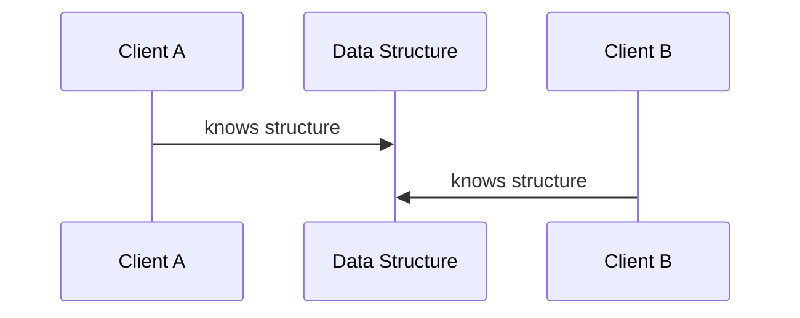
##### Time
1. The successful execution of a task by one component depends on the timing of the execution of another task by another component. Order and time are important
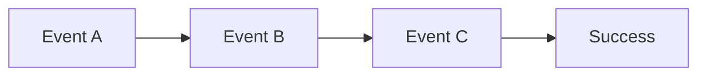
###### Sequential Dependency
One process must be completed before another can start. Example; Transactions in financial trading system
###### Scheduling Dependency
Tasks must be executed as specific times or interval. Example; Batch process jobs / push notifiations
###### Real-time Constraints
Processes must respond to events within strict time constraints. Example; Video frames in video stream system

2. Time coupling makes the system
   - Hard to understand
   - Increases risk of errors which are hard to debug and reproduce

##### Excution Location
1. Coupled to Physical or virtual env
2. Examples;
   - Highly optimized code for specific processor / GPU
   - Application dependent on a specific /local file system
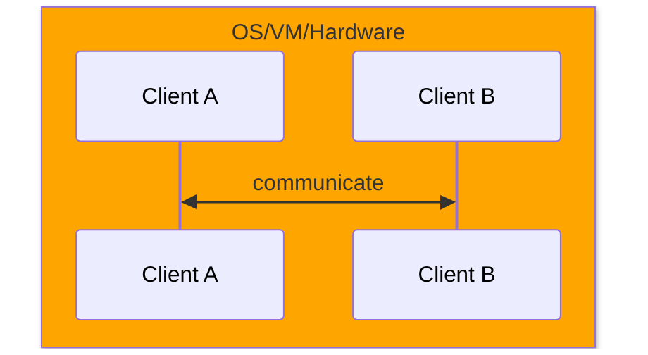
##### Inheritance
1. Strongest type of coupling
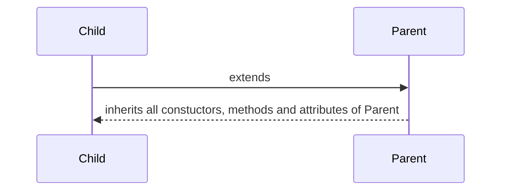
### Aim for Loose Coupling
Goal is to have few, well-defined, well-structured, and explicit dependencies
#### Keep the number of dependencies low
#### Keep dependencies simple

### Benefits of Loose Coupling
1. Loosely couple components
   - can interact, but need to know very little about each other
   - introduce fewer "side effects" on changes
2. Degree of dependency for involved components is as low as possible
   - Easier to understand
   - Easier to re-use
   - Easier to replace, more flexible
   - Changes are local, not global

## High Cohesion
1. Degree to which elements of a building block, component or module belong together.
2. High Cohesion - when the functionlity of elements within a component is strongly related to each other
3. Low Cohesion - when elements that aren't related to each other reside in the system component
4. High Cohesion within a compoent <-> Low Coupling between components
5. Challenges
   - Cohesion depends on the context and is not always very obvious
   - Cohesion is hard to measure directly
  
## KISS & YAGNI
1. Keeping designs as simple as possible
2. Complexity kills systems
   - Easier to comprehend and maitain
   - Less error prone
> Make things as simple as possible but not simpler
> - Albert Eintein
3. Challenges
  - If the system is too simple (not flexible enough), future changes may be difficult to make
  - If the system is too flexible, the system will be extra complex - if the changes never come our way, the complexity will stay in the system for ever
  - Performance optimizations may make the design more complex. Consider the necessity of those optimizations! - If they are necessary make the compromise and prefer performance. If they are not necessary, wait for Moore's law and prefer simplicity

## DRY
1. Avoid duplicating code, data or responsibilities
2. Benefits
   - Changes are easy to make
   - Fewer tests
   - Easy to understand
3. Challenges
   - Increased coupling - in most cases the benefits of DRY outweigh the downsides. In microservices architecture though, you may decide to skip DRY in certain cases
  
## Murph's Law
Expect Errors - Anything that can go wrong will go wrong
### Anticipate Errors
   - What do I depend on?
   - What can go wrong?
### Contain the error - so it doesn't bring down the system
   - Examples - Checking error status, Error handling, throttling, backpressure, circuit breaker, etc
### Support Error Analysis
- Logging
- Metrics (request rate, error rate) and dashboards
- Distributed tracing, etc

## Pastel's Law
Robustness Principle - Be conservative in what you do, and be liberal in what you accept from others.

Be precise and strict when designing your components, but
- Tolerate errors in other components
- Be able to recover from errors
- Degrade gracefully

Downsides
- High complexity due to accumation of legacy code and need to handle many edge cases - bloated software and technical debt
- Performance overhead

## Abstraction
1. Identify useful generalizations
   - Emphasize common properties or functionalities. Omit / hide unnecessary details
2. Depend only on abstractions, not on implementations
   - Complements DRY, SoC, Information hiding
3. Examples
   - ORM
   - Frontend frameworks like Angular, React create abstractions over HTML, CSS, JS
   - APIs
   - IaC - Infrastructure as A Code (Terraform, AWS CloudFormation)

## Conceptual Integrity
1. Goal is to use clear, recongnizable concepts / abstractions consistenty through out the entire system
2. Important for creating systems that are
   - Understandable
   - Maintainable
   - Scalable
> ...conceptual integrity is  the most important consideration in system design.
>
> It is better to have a system omit certain (anamolous) features and improvements, but to reflect one set of design ideas, than to have one that contains many good but independent and uncordinated ideas.
> - Fred Phillips Brooks

3. Examples
   - Unix - Everything is a file
   - Lisp (programming language) - everything is a list
   - Smarttalk (programming language) - everything is an object
   - Haskell / Clojure / Erlang - everything is immutable
4. Benefits
   - Lower learning curve
   - Reduces elements of surprise

## SOLID Principles
### Single Responsibility Principle (SRP)
Each component should be responsible for only one clearly defined task
1. Encapsulate and contains only functions or sub-components directly contributing to the task
2. Closely related to SoC - increases cohesion, reduces coupling
3. A class should have only one reason to change
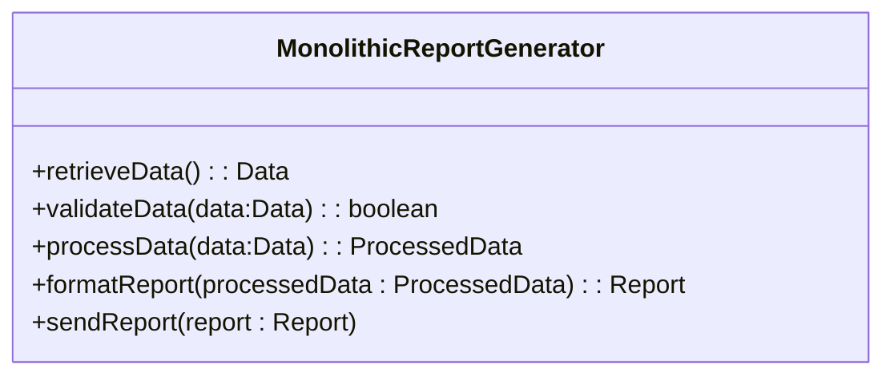
Modular Report Generator following SRP
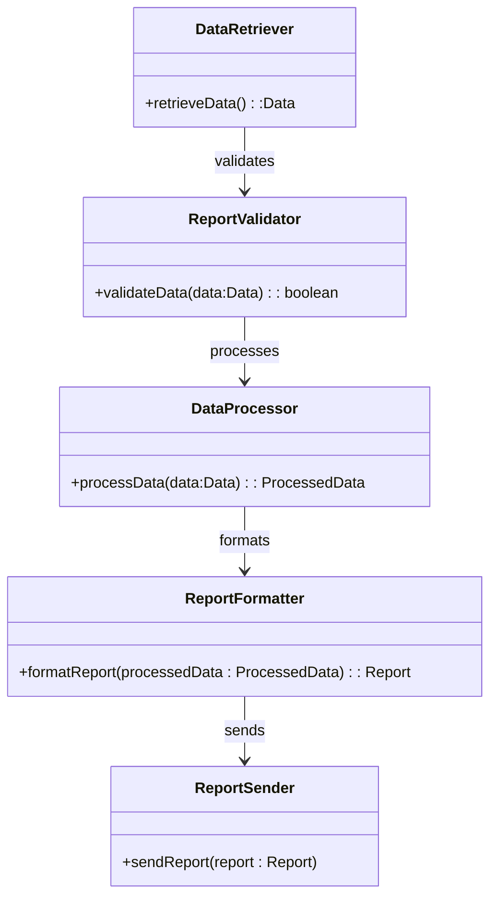
3. Other Examples;
   - Methods within a class - filter(data), write(data), read(data)
   - Database tables: Users table, Products table, Orders table
   - User Interface components: Buttons, Dropdowns, Radio Box
   - Resources in REST API: /users/{id}, /products/{id}
   - Modules / packages: net.http, io.file, db.mysql
   - Microservices : Images service, Notification service, Fraud Detection Service
     
### Open Closed Principle
Components should be open for extention but closed for modification
1. We should be able to extend behaviour and features without changes to source code of the original component
2. No side effects from future extensions
3. Changes do not require modifications to existing users of this component
4. Variaous way to implement
   - Stable (closed) interface
   - Inheriting from abstract class
   - Extension points and delegation
   - Various patterns - Strategy, Decorator, Observer, Factory, etc;
     
Abstract Class Example
To add a new Shape, say Triangle, doesn't require to change any of the existing components
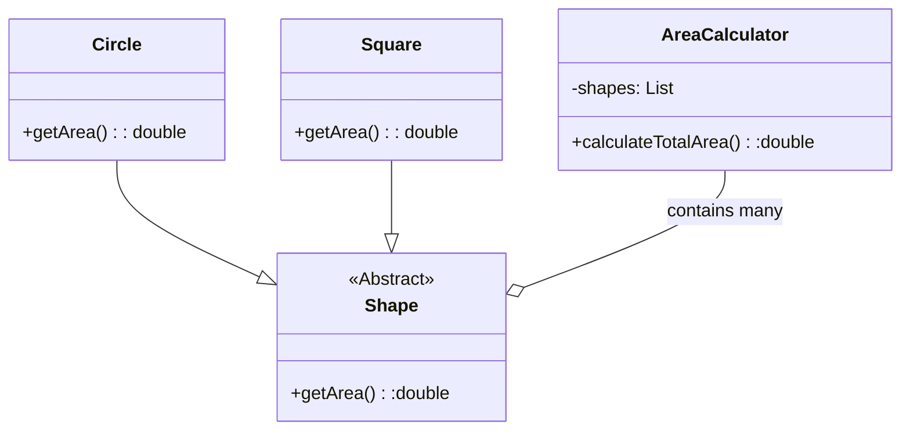


### Liskov Substitution
An object of a superclass should be replacable with objects of the subclasses
- Without surprises or side effects that break the application
- Without additional restrictions, prior setup or later cleanup

Example
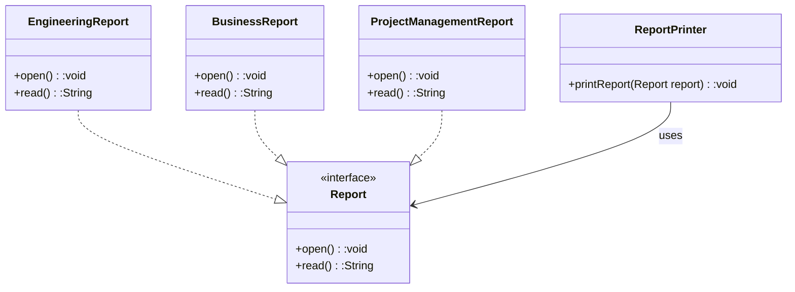
```
public class ReportPrinter{
  public void printReport(Report report) {
      report.open();
      System.out.println(report.read());
  }
  // Following works becuase it is following Liskov's substitution principle
  public static void main(String[] args) {
    ReportPrinter reportPrinter = new ReportPrinter();
    
    Report engReport = new EngineeringReport();
    reportPrinter.printReport(engReport);

    Report bizReport = new BusinessReport();
    reportPrinter.printReport(bizReport);
  }
}
```

But following will break the principle;
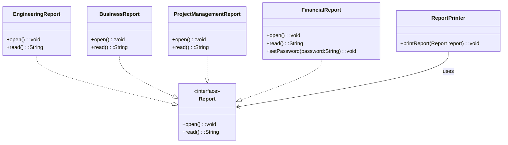
```
  public class FinancialReport implements Report {
    private String password;

    public void setPassword(String pwd) {
      this.password = pwd;
    }

    @Override
    public void open() {
      if (password == null)
        throw new RuntimeException("Unauthorized access");
    }
      //open report...
  }

    @Override
    public String read() {
        //returns report content...
    }
```
Following will throw an exception;
```
  Report finReport = new FinancialReport();
  reportPrinter.printReport(finReport);
```

To make it work, we have to update ```ReportPrinter``` class;
```
    public class ReportPrinter {
      public void printReport(Report report) {
          if (report instanceOf FinancialReport finReport) {
            finReport.setPassword(..);
          }

          report.open();
          System.out.println(report.read());
      }
    }
```

The ```FinancialReport``` class violates the principle in 2 ways;
1. It is more restrictive than the ```Report``` base class by throwing an exception in ```open()``` method
2. It requires an additional setup to set the password

### Interface Segregation
1. Clients should not be forced to depend on methods they do not use.
2. Multiple small and specific interfaces are better than a single, large one
3. Split large interfaces by semantics or by responsibility
4. Promotes loose coupling and improves maintainability and changeability

Example;
It doesn't make sense ```BookManager``` to depend on the ```MediaLibrary``` interface because it has to implement ```playAudio()``` and ```playVideo()``` methods. Either the methods remain empty or throw ```UnsupportedException```. The same goes for other unrelated methods for ```AudioManager``` and ```VideoManager``` classes.
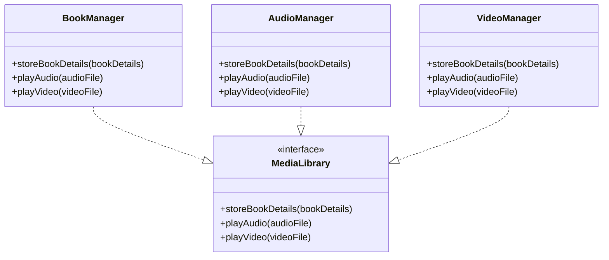
Following Interface Segregation Principle
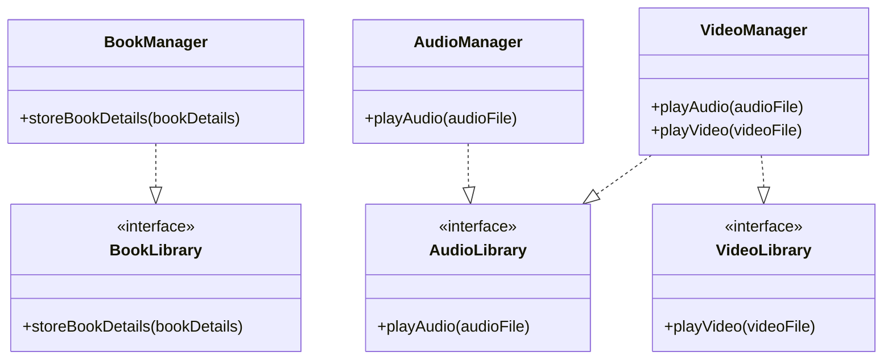

### Dependency Inversion
Related to dependency injection and inversion of control, but not the same thing.
1. High level modules should not depend on low level modules. Instead, both should depend on abstractions (e.g.; interfaces)
2. Abstractions should not depend on concrete implementations
3. All concrete implementation classes should depend on abstractions

Example;
If you don't use this principle. The higher level ```FlightReservationService``` uses 2 lower level classes ```SqlDatabaseRepo``` and ```FileLogger```. This creates tight coupling and dependency.
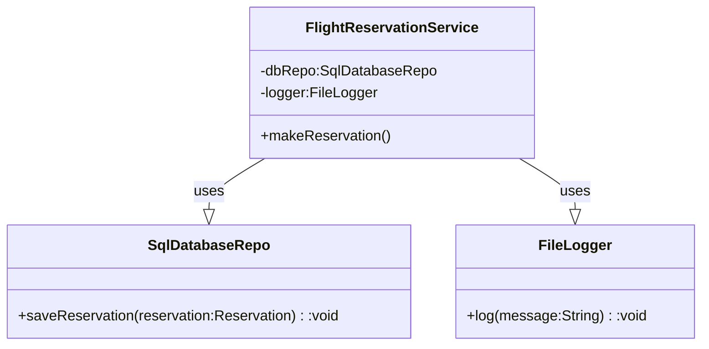

Applying dependency inversion principle
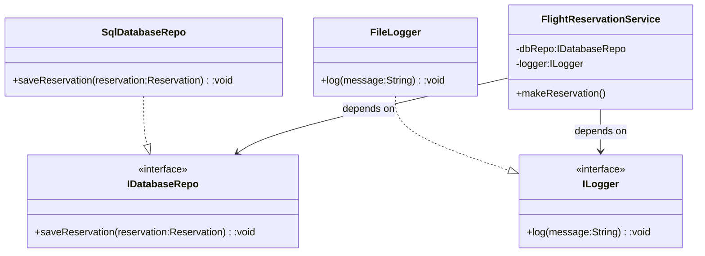
Benefit of the Dependency inversion priciple - Example;
We can introduce new DatabaseRepos and Loggers implementations without any impact on higher level code;
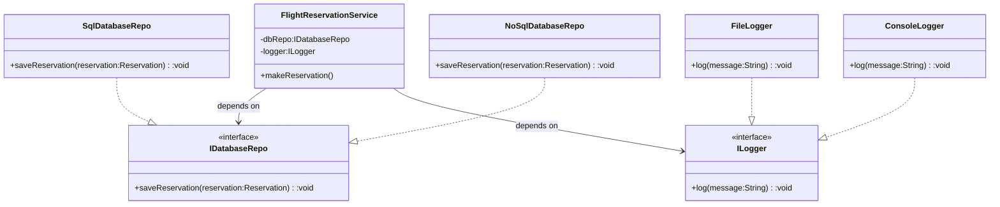

   
