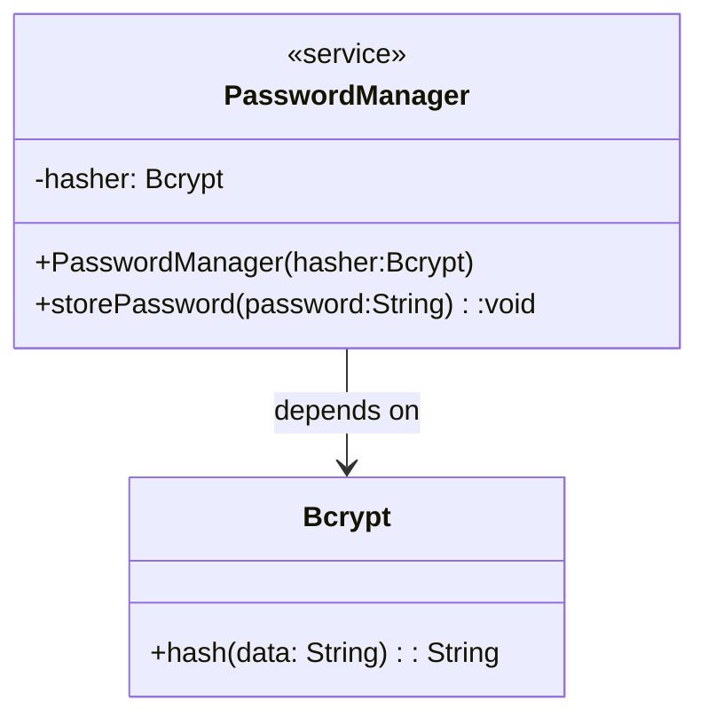
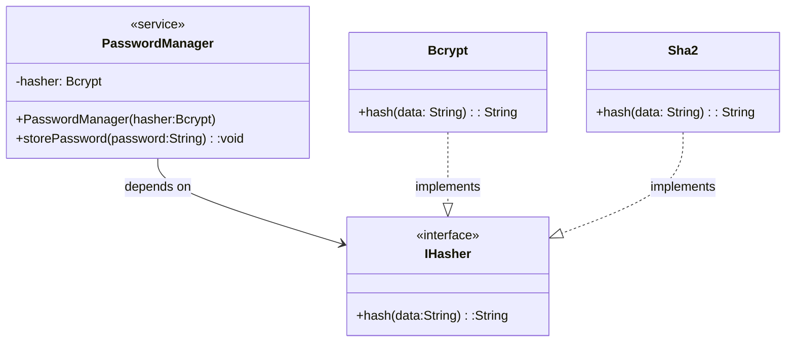
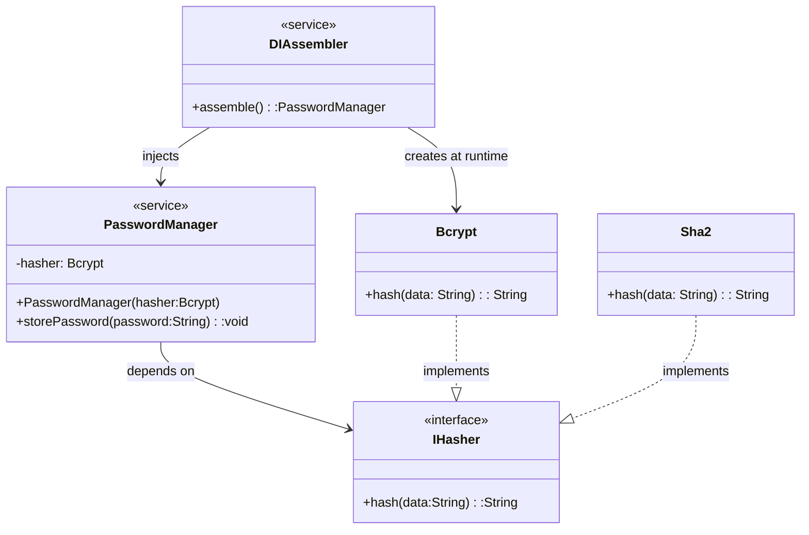
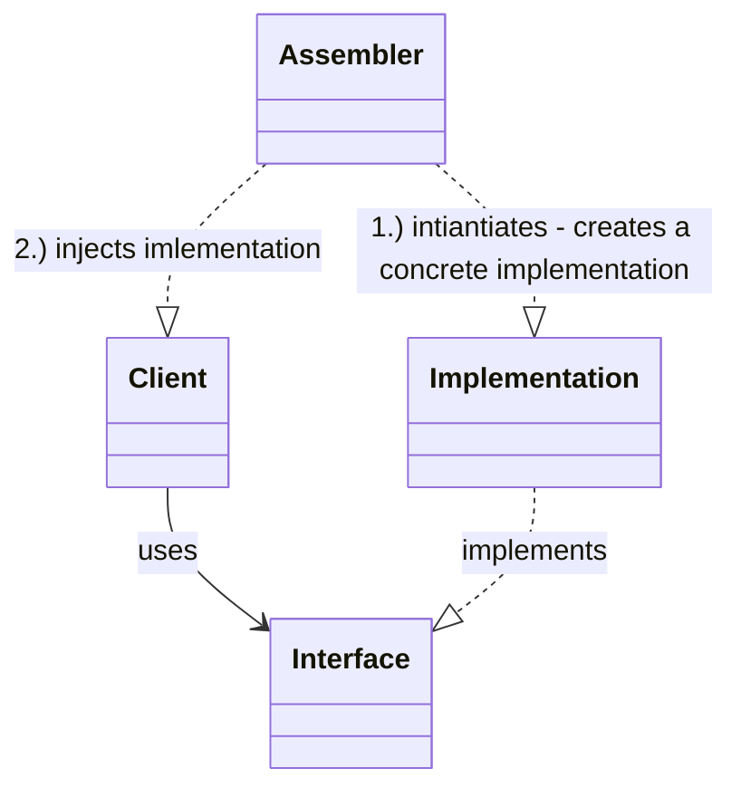

# Introduction and Motivation
Libraries allow us to reuse code. Frameworks allow us to reuse structure.

Patterns allow us to reuse thinking.
- Apply solutions to problems in different domains
- Apply solutions to different levels of abstraction

## Patterns
- Describe   reusable (abstract or concrete) solutions to common problems
- Provide a recognizable structure and terminology for those solutions

> Patterns are discovered, not invented. Universe is full of them.

## Designing with Patterns
Patterns offer approaches for
- Decomposition  of a system
- Distribution of responsibilities within a system

# Layers Pattern
## Introduction
System is structured into stacked layers of services. 
### Each Layer;
- Encapsulates details
- May provide abstraction
- Provides services to layers above it

### Dependencies
- Can depend on layers below it
- Cannot depend on layers above it

### Usage
- Directed from upper to lower layer

### Communication
- Can be directed in both ways

## Examples
### OSI (Open Systems Interconnection) Model


### Multi-Layered / N-Layered Monolith Architecture
Web Architecture


### Multi-Tiered Architecture
Each tier runs in its own process, and even separate computer.
3-Tiered Architecture


## Closed-Layered Architecture vs. Open Layered
### Closed /Strict Layer Architecture
A layer above can communicate only with the immediate layer below it.
#### Advantages
- Modularity
- Simplifies debugging and testing
#### Disadvantages
- Potential inefficiency / performance overhead

### Open Layered
A layer above can communicate with any layer below it.
#### Advantages
- Can bypass layers - higher efficiency / performance
#### Disadvantages
- Harder to understand / maintain
- Risk of bugs

## Pros and Cons
### Pros
1. Layers are independent of each other
   - makes it easier to distribute tasks for development
   - each layer can be installed, maintained independently in production - e.g.; n-tiered application
   - implementations are interchangeable
2. Unidirectional dependencies (no circular dependencies)
3. Easy to understand - easy to develop, test and maintain

### Cons
1. Layers are overhead when they only pass information to following layers to deliver a specific service
2. Some changes (e.g.; adding a data field) may required changes to all layers

# Pipes and Filters
## Introduction
Data flows from source to sink through pipes & isolated software components, called filters.

### Pipes
1. Transport data / message between filters
2. Can buffer data - if next filter is not yet ready to process it

### Filters
1. Isolated processing units, unaware of other filters
2. Transform, Aggregate or manipulate data
3. Connects to multiple input/output pipes


## Examples
### GStreamer (pipeline-based multimedia filters)
### Video Encoding Pipeline

### Piping command-line utilities in Linux / Unix
```cat input.txt | grep 'search_term' | sort | uniq -c```
- | are pipes. They are memory buffers allocated by OS
- Each command, running as separate processes, are filters
### ETL BigData Pipeline


## Pros and Cons
### Pros
1. Simple (linear) dependencies
2. Flexible
3. Easily scalable
4. Filters can be developed independently

### Cons
1. Difficult error tracking and  handling
2. Buffers might overflow
3. Sharing global data might be difficult

# Micorservices Architecture
## Motivation
Monolithic architecture (N-tiered) is ideal for 
- Small teams
- Small and non-complex codebase

As the size and complexity of our codebase grow, it becomes difficult to;
- Troubleshoot
- Add new features
- Slower to build, test and load in IDE

On organizational side, scalability suffers because;
- The more engineers we add to the team, the more code merge conflicts we get
- Our meetings become larger, longer and less productive

Once we start seeing these problems, we should consider migrating our archicture to micorservices.

## Introduction
1. Divides large system into small units, called micorservices
2. Each microservice can be independently
   - Developed
   - Deployed
   - Operated / Maintained
   - Changed / Replaced
   - Scaled
3. Services communicate over network

### Benefits
1. It enables faster on-boarding of new engineers because of smaller, understandable codebsae.
2. Each microservice can be built using appropriate technology
3. Can run on commodity hardware
4. Higher organizational velocity - independent, parallel development

## Best Practices
1. SRP
   - Each service should be responsible for only one business capability or domain
2. Separate database per service - Loose coupling.

## Notes  
1. Some data duplication (breaking DRY) is expected
2. Some performance overhead of getting data from another microservice is expected (cost of information hiding)

## Pros and Cons
### Pros
1. Improves changeability and flexibility
2. Decouple technology decisions
3. Multiple versions of service can coexist
4. Good scalability
5. Fast development, shorter time to market

### Cons
1. All CONS of distributed systems
   -   Network latency
   -   Outtages / connection issues
   -   Bandwidth limitations
2. More sophisticated error handling
3. More complex deployment & operations
4. Dependency resolution at runtime may cause hard to find errors

# Dependency Injection
## Introduction
Following doesn't follow Dependency Inversion principle, because higher level class is dependent on lower level class directly.

Let's apply Dependency Inversion Principle to above example;


But we still need to create lower level class object and pass it explicitly to a higher level class constructor;
```
    public class App {
      public static void main(String[] args) {
        // Decide which hasher to use
        IHasher hasher = new Bcrypt();

        // Create ```PasswordManager`` with a choosen hasher
        PasswordManager passwordManager = new PasswordManager(hasher);

        // Use the ```PasswordManager```
        passwordManager.storePassword("myStrongPassword123");
      }
    }
```
For a large system, with lot of dependencies, this would be a nightmare. That's where Dependency Injection comes into picture. 
> Dependency Injection = Dependency Inversion + Inversion of Control

With this additional principle, Inversion Of Control, DI introduces an additional component, commonly referred as Assembler or Injector.



To sum this up, DI framework is incharge of;
1. Creating / managing an instance of an abstract interface
   - Decides which specific implementation to use - it can based on class type, configuration, runtime env, explicit conditions, etc
   - Responsible for life cycle management of dependencies (create, initialize, ...)
2. Injects the implementation that client is depending on via
   - Setter injection
   - Constructor injection




## Examples
1. Spring framework

## Dependency Inversion Principle vs Inversion of Control vs Dependency Injection
### DIP
- High level modules should not depend on low-level modules
- Both should depend on abstrations
### IoC
- Component registers itself with the framework, later called by the framework
- Third party libraries define the control flow rathar than the app-specific components
- Other applications of IoC: Callbacks, Scheduler, Event loops, Observer Pattern,...
### DI
DI applies DIP and a special case of IoC (Creation + injection of instances of abstractions that client depends on)

## Pros & Cons
### Pros
1. Supports Open-Closed, Loose coupling and Dependency Inversion
2. Manage dependencies by "configuration"
3. Vastly improves
   - Extensibility
   - Flexibility, Adaptibility
   - Testability (mock components)
4. Better code readability

### Cons
1. Hard learning curve for developers
2. Shifts complexity to DI frameworks - migrating to another framework becomes difficult
3. Static analysis is difficult / impossible -  because which objects to create and in which order is decided at runtime
4. Things fail at runtime (not compile time)
