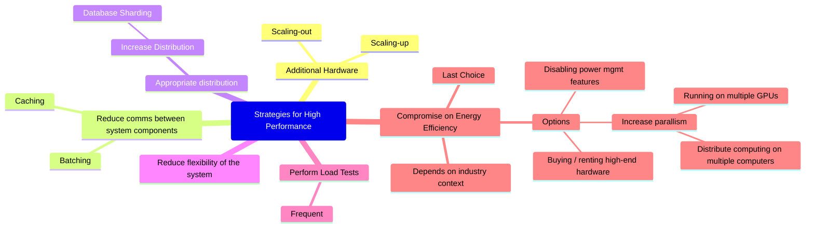
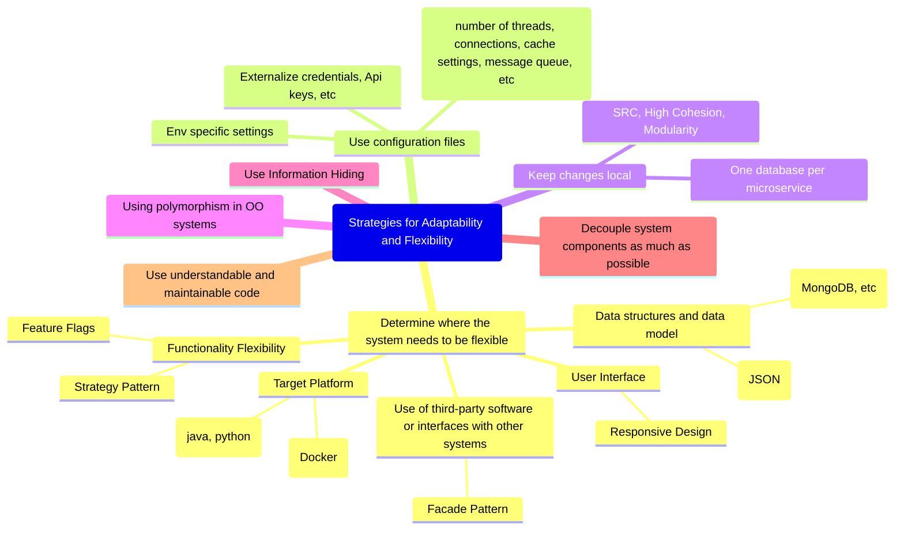
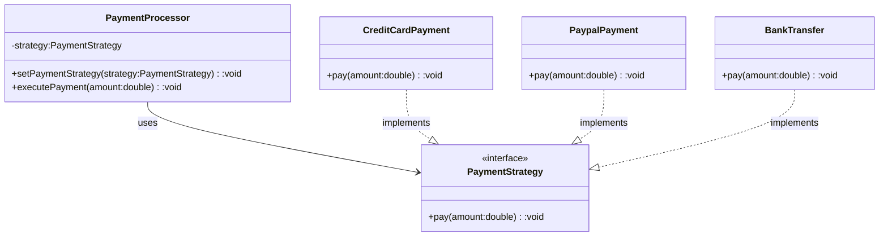
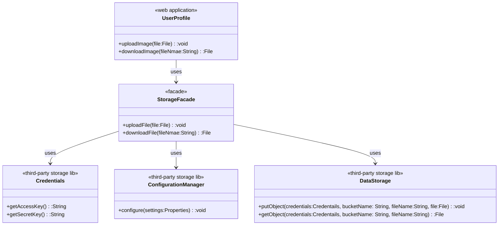
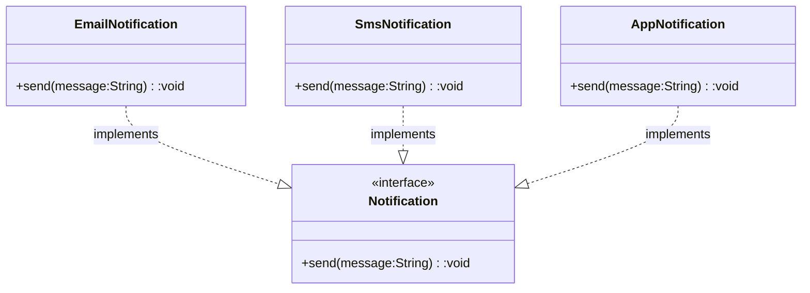
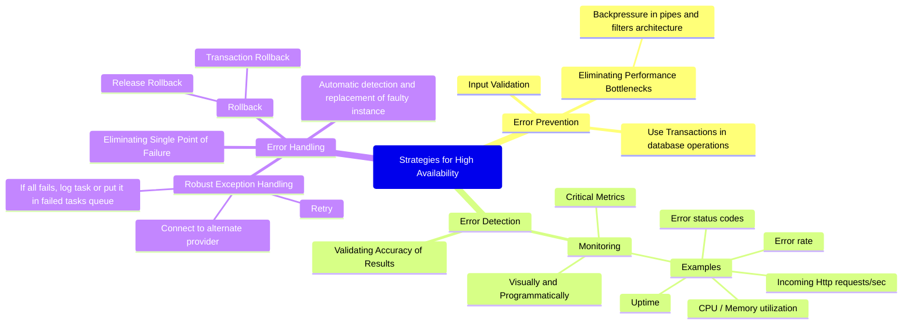

## Introduction
### How to achieve Quality Goals
1. Develop high-level solution strategies in parallel to the detailed concepts (e.g.; cross-cutting concepts, funtional and technical components, etc)
2. Use principles, patterns in creating the solution strategies
3. No single approach that gaurantees a suitable solution

## High Performance

### Reduce Flexibility
Following solution has lot of flexbility;
1. minimumAmount of txn is configurable - and is read from external config file
2. we allow user to perform txn in currency of their choice - involves currency conversion
3. fee we collect for txn is  also externally configurable - here coming from db

Each of these flexibility increases latency.
```
  public class TransactionProcessor {
      ...
      // In real world, amount should be of type BigDecimal
      public boolean processTransaction(String type, double amount, String currency) {
          if (amount < config.getJSONObject("minimumAmount").getDouble(currency)) {
              LOGGER.info("Txn amount is below the min");
              return false;
          }
          double fee = database.getCurrentFee(type, currency);
          double netAmount = amount - fee;
          if (netAmount <= 0) {
              LOGGER.info("Txn amount is too low to cover the fees");
              return false;
          }
          ...
      }
  }
```
The solution with reduced flexibility. Need to strike a right balance when reducing flexibility.
```
  public class TransactionProcessor {
      ...
      // In real world, amount should be of type BigDecimal
      private static final double MINIMUM_AMOUNT_USD = 10;
      private static final double WITHDRAWAL_FEE_USD = 2;
      private static final double TRANSFER_FEE_USD = 3;
      public boolean processTransaction(String type, double amount) {
          if (amount < MINIMUM_AMOUNT_USD) {
              LOGGER.info("Txn amount is below the min");
              return false;
          }
          double fee = (type.equals("withdrawal")) ? WITHDRAWAL_FEE_USD : TRANSFER_FEE_USD;
          double netAmount = amount - fee;
          if (netAmount <= 0) {
              LOGGER.info("Txn amount is too low to cover the fees");
              return false;
          }
          ...
      }
  }
```

## Adaptibility & Flexibility

### Funtionality Flexibility - Strategy Pattern

```
    public class PaymentProcessor {
        private PaymentStrategy strategy;
        //Point of flexibility. Allows us to change the implementation details at runtime
        public void setPaymentStrategy (PaymentStrategy strategy) {
          this.strategy = strategy;
        }
        public void executePayment(double amount) {
          strategy.pay(amount);
        }
    }
```
### Funtionality Flexibility - Feature Flags
```
  public void displayUserProfile() {
      if (config.isEnhancedProfileEnabled()) {
        displayEnhancedUserProfile(user);
      } else {
        displayBasicUserProfile(user);
      }
  }
```
### Facade Pattern (Used as Anti Corruption Layer)

### Polymorphism
1. Allows objects of a different classes to be treated as objects of common superclass.
2. Enables flexibility to perform the same action on different objects with different implementations

```
    public class NotificationService {
        public void sendAnnouncement(List<Notification> notifications, String message) {
          for(Notification notification : notifications)
              notification.send(message);
        } 
    }
```
  
## High Availability

### Validating Accuracy
Running 2nd Analytics process that runs on a schedule and counts all the accout balances of all the customers & adds the total net wire-transfers in and out of our bank to ensure no money is missing without any paper trace.

