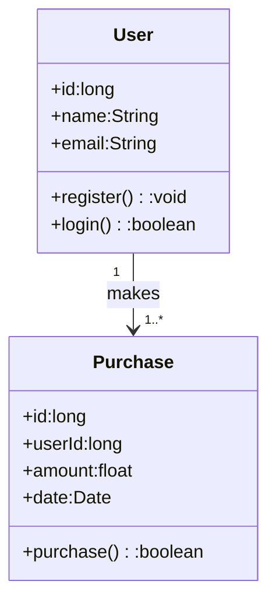
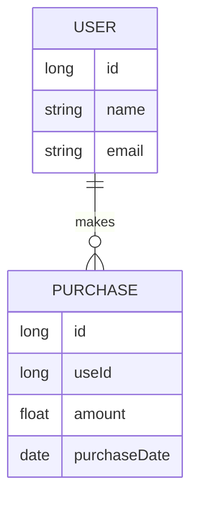
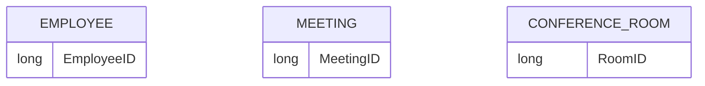
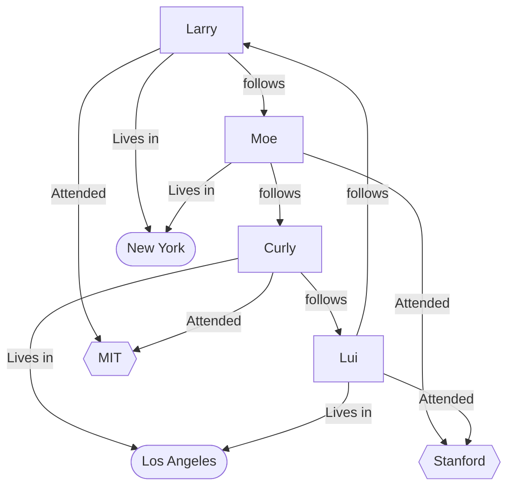

## What is Data Modelling?
Process of analyzing, defining and visualizing data stored/managed in our system

The way, Software Architecture is a blueprint for the;
- Structure of our system's components, relationships and rules and principles guiding its evolution

Data Model is a blueprint for the;
- Data Entities in our system, their attributes, their relationships, rules governing the data (privacy, security, etc) and how this data is stored and used

Data modelling is  somewhat similar to class modelling in OOP. In Class modelling, we have classes with fields. In Data modelling, we have entities with attributes. Classes can represent behaviour in-terms of methods but entities don't behaviour.
Class Modelling

Date Modelling


## Impact of Data Modelling on Software Architecture
Data model has a direct impact on system's quality attributes & technology choices.

## Notes
1. NoSQL (Document / Key-Value)  store - Tradoff - Better scalability + Read performance  Vs. Consistency
2. GraphDB - better graph traversal vs standardization and complexity

## Data Model Types
### Conceptual / Domain Model
1. Typically created by business stake-holders
2. Big picture representations of:
   - Data entities- Properties / Attributes
   - Business rules / relationships
3. Informal - meant explore initial requirements withou any technical details
   - No data types
   - All attributes are not mentioned
   - Cardinality (one-to-one/one-to-many/many-to-one/many-to-many) is optional
   - No mention of database technologies
4. A nice tool to communicate ideas between
   - Business stakeholders
   - Technical stakeholders

### Logical
1. Less abstract than the conceptual model
2. Relationships are defined between entities
3. Cardinality types are defined
4. Targetted more towards software engineers and data engineers
5. Database/technology independent
6. Uses more formal notations in the diagrams like;
   - Informational Engineering / "Crow's Foot" notation (Commonly used)
   - Baker's notation
   - IDEF1X
   - Chen's notation
   - UML (unofficial)
  
#### Crow's Foot Notation Example


Inticates that a user can have 0 or more reviews

<br/>Indicates that reviews can belong to 1 user or atmost 1 user.


### Physical
1. Map conceptual or logical model to a more technology specific physical model
2. RDMS example;
   - Entities -> Tables
   - Attributes -> Columns
   - Types -> VARCHAR(size), INT(size), FLOAT(size, d), TIMESTAMP(fsp),...
   - Keys/Identifiers -> Primary Keys / Foreign Keys
3. Document Store (NoSQL DB) example
   - Entities -> Collections
   - Attributes -> Properties
   - Types -> ObjectId, Int32, Double, Decimal128, Timestamp, etc...
4. Targetted towards data engineers

## Data Modelling Process
### Identify the Entities
1. Entities are collections of distinct;
  - Real world objects
  - Locations
  - Concepts
  - Events
  - etc
2. Each record / instance is
  - Uniquely identifiable
  - Has properties / attributes
3. "Nouns"

Example of Conference room booking system;
An **employee** can schedule a **meeting** with one or several other **employees**. Every **meeting** takes place in a specific **conference room**. Only one **meeting** can occur in a **conference room** at any given time.

### Identify Attributes / Properties of each Entity
1. Each entity should have atleast one attribute
2. Stores single, meaningful piece of information
   ```mermaid
    erDiagram
      EMPLOYEE {
        long EmployeeID
        string FirstName
        string LastName
        string Department
        string EmailAddress  
      }

      MEETING {
        long MeetingID
      }

      CONFERENCE_ROOM {
        long RoomID
      }
    ```
### Identify Relationships between Entities
1. Described through verbs
   ```mermaid
    erDiagram
      EMPLOYEE }o--o{ MEETING : "attends/schedules"
      MEETING }o--|| CONFERENCE_ROOM : "takes place"
   
      EMPLOYEE {
        long EmployeeID
        string FirstName
        string LastName
        string Department
        string EmailAddress  
      }

      MEETING {
        long MeetingID
        timestamp MeetingTime
        long Duration 
      }

      CONFERENCE_ROOM {
        long RoomID
        string Location
        long capacity  
      }
    ```
After following above 3 steps, we have our conceptual model as shown above.

### Identify the Data Modelling Technique and Create the Physical Data Model
#### Data Modelling Techniques
##### Relational Data Modelling
1. Entities -> Tables
2. Attributes -> Columns
3. Each instance of entity -> Row inside the table
Physical Model
   ```mermaid
    erDiagram
      EMPLOYEE ||--o{ MEETING_PARTICIPANT : ""
      MEETING ||--o{ MEETING_PARTICIPANT : ""
      CONFERENCE_ROOM ||--o{ MEETING : ""
   
      EMPLOYEE {
        UUID EmployeeID PK
        VARCHAR(255) FirstName
        VARCHAR(255) LastName
        VARCHAR(255) Department
        VARCHAR(255) EmailAddress  
      }

      MEETING {
        UUID MeetingID PK
        TIMESTAMP MeetingTime
        INT Duration
        UUID ConferenceRoomID FK 
      }

      CONFERENCE_ROOM {
        UUID RoomID PK
        VARCHAR(255) Location
        INT capacity  
      }

       MEETING_PARTICIPANT {
         UUID MeetingID FK
         UUID EmployeeID FK
       }
    ```
###### Advantages
   1. Joining tables is very easy
      - Allows us to create complex relationships between entities
   2. Good query optimizers
   3. Support transactions and strict consistency
   4. Schema enforcement
      - Schema on Write - i.e.; write to db will fail if write doesn't follow database imposed schema
     
###### Disadvantages
   1. Tables/rows don't fit the programming data structures (List/Map/Arrays/etc)
   2. Requires ORM technologies
      - Solves the mapping between tables with attributes -> Objects with data structures
      - Creates dependencies on ORM tool & performance overhead
   3. Strict Schema validaiton
      - creates performance overhead
      - schema updates are difficult, time consuming and introduce downtimes 

##### Document Data Modelling
   1. Entity -> Collection of documents of the same type
   2. Each record / instance is a document
      - Set of properties in a tree like structure
   3. Flexible schema
      - Schema on Read - i.e.; schema is enforced by our app code instead of database

###### Advantages
  1. Native support for programming language data structures (lists, arrays, maps, etc)
  2. Ideal for;
     - Entities have no relationships
     - Entiteis have One-to-Many relationships - no need for complex join operations & better storage locality for each record
  3. Flexibile schema
     - can introduce new properties without any complex migrations
     - no downtime
  4. Easily scalable compared to RDBMS     

  In RDBMS, getting data from multiple tables with one-to-many relationships could have performance overheads due to joins involved. See below;
  

  But it is very efficient (reading and updating) in case of document data model;
  

###### Disadvantages
  1. Not good for many-to-many and many-to-one relationships
  2. Flexible schema (schema on read) is not always safe

##### Graph Data Modelling
 1. Records are modeled as nodes in a graph, labeled with an entity type
 2. Each node can have
    - properties (with key-value pair)
    - relationships to other nodes


   
###### Advantages
1. performing graph traversals through an unknown number of edges (unknown number of joins) is easy & efficient
2. Good for;
   - Many-to-one
   - many-to-many relationships
   Examples; Social Media, Recommedations systems, **Route Optimizations**, knowledge graphs
3. Supports special query languages (like Cypher) for easy graph querying

###### Disadvantages
1. Not great when we have a high degree of connectivity
2. Not suitable when number of joins is small and predefined

### Optimize Data Model
#### Normalization
Reduce duplication and save storage cost

#### Denormalization
Improve read performance

#### Indexing
Improve search and query performance

#### Sharding / partitioning
Improve scalability

#### Replication
Higher availability and fault tolerance
