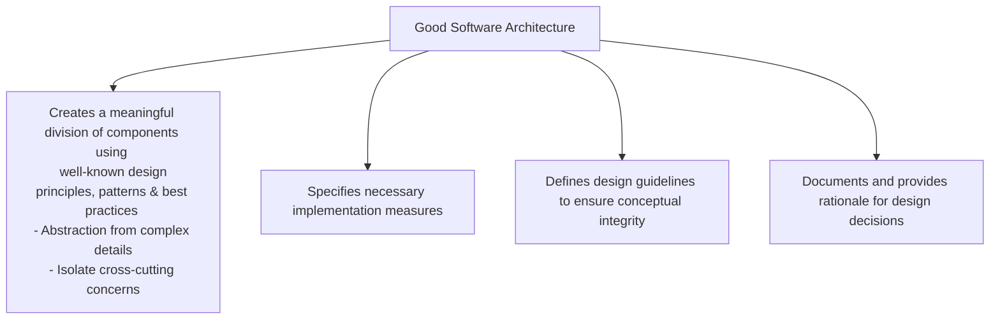
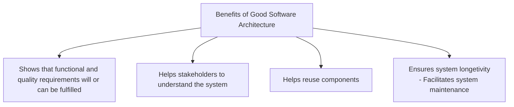
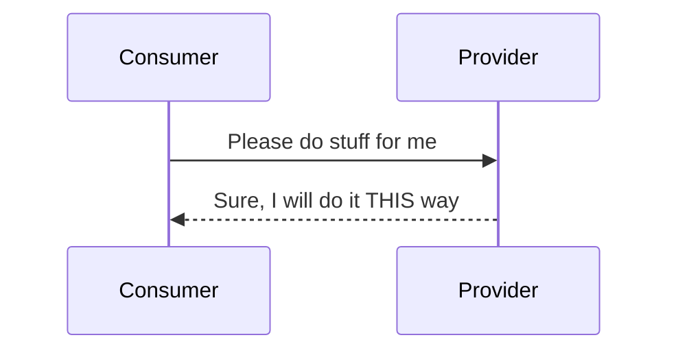
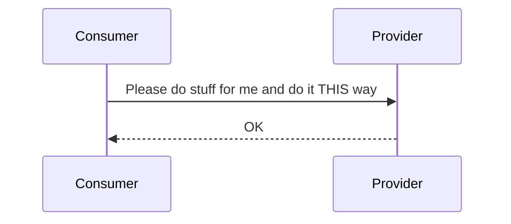

# Motivation for Software Architecture
1. Low quality product -> Customers will leave
2. Poorly Structured software that is hard to maintain -> Constant rework + low profit margin
3. Daunting for existing developers -> Developers get demoralized and leave
4. Difficult to for new developers to learn -> Will be reluctant to join, low productivity

# What is "Good" Architecture?
Good Architeture is contextual depending upon many factors;
1. Envrionment
2. Scale
3. Customers
4. Budget

# Software
Computer programs, procedures and possibly associated documenetation and data pertaining to the operation of a computer system.

1. Programs - Multiple applications
2. Proceducres - Version Control, Review Process, Release Process
3. Documentation - Developer / User Guide
4. Data - Files / Databases

Software architecture is essential for a long-term success of "Software intensive systems".

# Software Intensive System
A system for which software is a major technical challenge and is perhaps the major factor that affects system schedule, cost, and risk.

<b>System</b> is combination of interacting elements organized to achieve one or more stated purposes.

# Software Architecture
## What does it provide?
1. The structure / organization of a software system. 
2. It impacts the system's qualities; modifiability, performance, security, etc. Often, it is orthogonal to the system's functionality
3. Software architecture is result of numerous design decisions;
<li>Make design decisions explicit - why is more important than the what.</li>
<li>Explain requirements and rationale behind design decisions</li>

## Goals & Benefits



## Software Complexity
Amount of human efforts required to understand something in order to change or extend it. <b><font color="red">Complexity kills software systems!</font></b>

> <i>"The goal of a software architecture is to minimize the human resources required to build and maintain the required system."</i><br/>Robert  C. Martin

## Project Goals vs. Software Architecture Goals
(Short term vs. Long term Goals)

1. Common Goals- Functional requirements, Quality Product
2. Project Goals (Short-term Goals)- Delivery on Time, and within budget
3. Software Architecture Goals (Long-term Goals)- Maintainability, Understandibility, Extensibility, Reduction of complexity, Long term investments (infra, technologies, knowledge)

Software architect has to <b>make right trade-offs</b> to meet long-term strategic goals and short-term operational goals of the current project.

## Essential Key Concepts
### Building Blocks (components, packages)
1. Unit of hierrachical (de)composition and encapsulation
2. Provides static structure
3. Different sizes depending on context. SMALL - function, class, data structure, module; MEDIUM - package, library, framework, program, script, container, pod); LARGE - Application Cluster / Container Cluster
### Relationship between Building Blocks
1. Components interact with each other -> Dynamic system behaviour. To interact with each other, components need interfaces.
2. Interface is a well-defined access point to a component (or system)
3. Software architecture defines interfaces in-terms of;<br/>- Systax, data structures, functional behaviour <br/>- Error behaviour, Quality characteristics, technologies, protocols, constraints, semantics, etc
### Relationship between Building Blocks and their environment
### Principles, Rules and Guidelines
1. Guide design of the building blocks and their relationships
2. Development process
3. System lifecycle
4. Cross-cutting concerns, etc

#### Interfaces
1. Interface imply connections, relationships and dependencies between components
2. Interface Examples; <br/> - Java - Java interfaces <br/>- Web apps/ services - REST, gRPC, graphQL <br/> Unix - File Interface

##### Types of Interfaces
###### Provided Interface (API)
Provider implements functionality and provides interface. Provider is the owner of the interface. Consumers depend on the interface.

###### Required Interface (SPI)
Service Provider Interface. Consumer provides interface. Functionality Provider implements the interface. Dependency is reversed compared to API. Provider has to implement as per the consumer interface. Used in 
1. IDE plugins; IDE defines interface, plugin providers implement the interface
2. Device Driver Interface; OS provides interfaces & Device drivers are implemented by device manufacturers as per the interfaces

###### Standard Interface
3rd party defines the interface. Consumer and provider follows the rules defined by the standard interface. Example; OAuthx.0, EMVCo standards

## Impacting Factors
### Stakeholder
An individual, group, or organization who may affect, be affected by, or perceive itself to be affected by a decision, activity, or outcome of a project.

### Requirements
1. Something that a system stakeholder wants / our system needs to provide
2. A document that includes needs, wants, and expectations of stakeholders

Requirements are classified into 3 groups;
#### Functional Requirements
1. What shall X do?
2. "required feature" - description of a feature that system needs to provide
3. When A happens, the system should do B
4. Functional changes are manageable

#### Quality Requirements (NFRs)
1.  How shall X be?
2.  "required quality"
3.  The system (or architecture or component) shall be secure (or maintainable, or efficient, etc)
4.  Examples; <br/><b>Online Store (Performance)</b> When a user conducts a product search, the system shall display results within 2 seconds for 95% of the searches. <br/><b>Banking Service (Security)</b>Only authorized persons can view the balance and perform transactions in a bank account.
5.  Changes or missing a quality requirement can have a significant impact to the system

##### Common Quality Requirements
###### Performance
1. Throughput: Work done per unit of time. Requests served / sec
2. Latency: Delay of completion of a task. Response time

###### Efficiency
1. Work done in relation to resources used. Efficient use of battery - relevant for Mobile apps, IoT systems

###### Scalability
1. <u>Potential</u> to increase performance
2. Scalability will not automatically increase performance but will allow you to do so
3. Vertical Scaling vs. Horizontal Scaling (Scaling up vs. Scaling out)

###### Elastic Scalability
1. Ability to increase performance when needed and to decrease it when it's no longer required to save on resources - commonly associated with cloud based systems

#### System Constraints
1. A constraint is a requirement that limits the solution space beyond what is necessary for meeting the given functional requirements and quality requirements
2. Externally imposed limitation on system requirements, design, or implementation or on the process used to develop or modify the system
3. Examples; <br/>- Technical Constraints - Being locked into a specific cloud vendor, Programming language<br/> - Budget Constraints - <br/> - Legal Constrainsts - how we store or use our customer data.
4. It is not always a bad thing - limiting our choices makes our life easier

Some of the influencing factors on system architecture that originate from system's context;
##### Technological Factors
Existing
1. Programming Language
2. Hardware Infra
3. Software Infra
4. Programming Guidelines
5. Operating Environment
6. Technologies and Tools
7. Availability of Runtime Environment
8. GUI
9. Communication Protocols
10. Programming Interfaces
11. Libraries, Frameworks and Components 

##### Organizational Factors
###### Structure of the company and project team
1. Simplified Conway's Law
> A system built by 4 teams will probably consist of 4 large building blocks. Often there is no technical necessity for this. Quality of communication between these teams influences the quality and type of system interfaces.

Application of Inverse Conway Maneuver. Examples; Layered and Microservices architectural styles
<br/>2. Decision Makers - Internal, External - Change in the decision maker, etc
<br/>3. Internal / external (outsourced) development
<br/>4. Commercial product vs. product for internal usage 

###### Resources (Budget, Time, Staff)
1. Contract / Project Budget: fixed price/ time
2. Time Schedule and release plan: flexible / fixed deadline
3. Priorities: Deadline / scope of functions - MVP vs Later vs Nice-to-have
4. Team: Number of team members, skill-set, availability, commitment

###### Standards
1. Process model, Quality Standards. Examples; ASPICE in automobile industry, PCI-DSS in payment domain
2. Test, approval and release process - Examples; Commit Signing
3. Tools - usage of specific tools, versions, etc

###### Legal
1. Liability issues - Burden of proof
2. Privacy laws, data protection, International legal issues
3. Examples - GDPR in EU, CCPA in California, HIPPA in US, COPPA for children's privacy

##### Product Related
###### Quality Requirements
####### Quality Attributes vs. Quality Goals vs. Quality Requirements
Quality Attributes
1. Properties. Examples; Performance, Availability, Security, Useability
2. Some are positively correlated. I.e.; improvement in one attribute improves related attribute
3. Some are negatively correlated. I.e.; one comes at the expense of the other attribute

   ```mermaid
     flowchart TB
       A[Quality Attributes] --> B[Scalability & Performance +ve]
       A[Quality Attributes] --> C[Simplicity & Understandability +ve]
       A[Quality Attributes] --> D[Reliability & Availability +ve]
       A[Quality Attributes] --> E[Memory Usage & CPU utilization -ve]
       A[Quality Attributes] --> F[Security & Usability -ve]
       A[Quality Attributes] --> G[Adaptability, Flexibility & High Performance -ve]
       A[Quality Attributes] --> H[Efficiency & Maintainability / Adaptibility]
   ```
####### Quality Goals
1. High level objectives
2. To achieve these goals; we need to utilize several quality attributes
3. Examples; Improving user experience and satatisfaction - this may mean improving performance and usability

####### Quality Requirements
1. Specific, actionable, detailed statements derived from quality goals - should be precise and measurable
2. Outlines the conditions a software system must meet
3. Examples; The system must be available 99.9% of the time

Example;
1. Quality Goal - Improve user experience and satisfaction
2. Quality Attributes Involved - Performance, Usability
3. Quality Requirements
<br/>- A user should see the product homepage in the browser within 500ms at most
<br/>- A product search feature should return relevant results within 2 secs with atleast 90% accuracy

Quality goals and requirements can
1. Align with or contradict each other
2. Support or compete with other influecning factors (project or business goals)

For quality requirements that cannot be easily quantified (Sustainability, Maintainability, Understandability), it is important to have clear criteria when the requirement is  met / the work is done. DoD.

###### Others
1. Open source vs closed source
2. One time purchase vs. subscription-based vs. consumption-based
