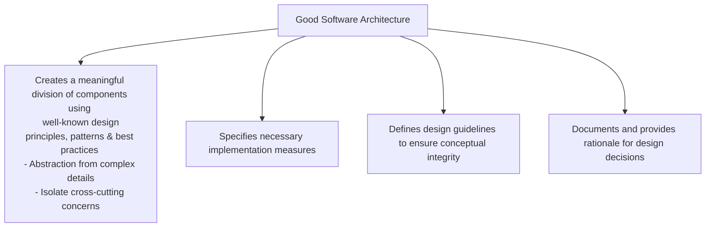
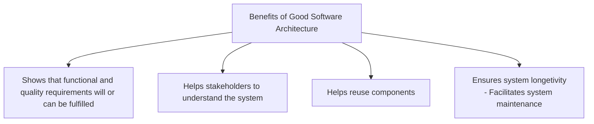
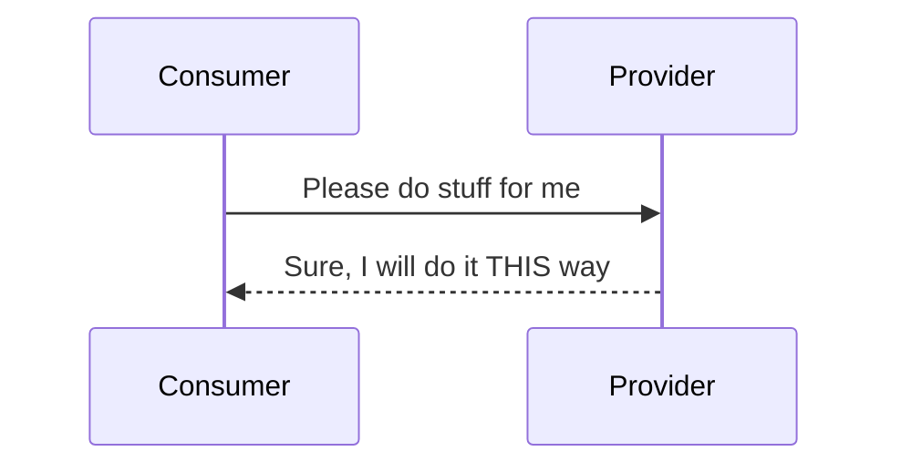
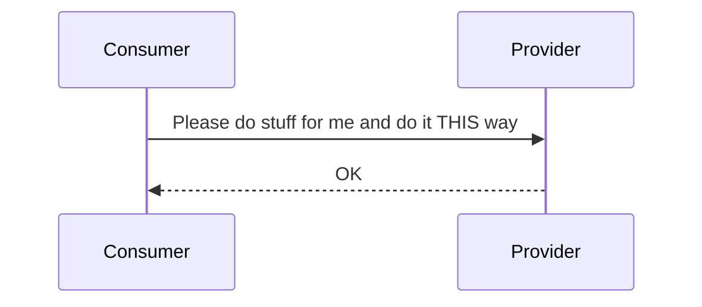

# Motivation for Software Architecture
1. Low quality product -> Customers will leave
2. Poorly Structured software that is hard to maintain -> Constant rework + low profit margin
3. Daunting for existing developers -> Developers get demoralized and leave
4. Difficult to for new developers to learn -> Will be reluctant to join, low productivity

# What is "Good" Architecture?
Good Architeture is contextual depending upon many factors;
1. Envrionment
2. Scale
3. Customers
4. Budget

# Software
Computer programs, procedures and possibly associated documenetation and data pertaining to the operation of a computer system.

1. Programs - Multiple applications
2. Proceducres - Version Control, Review Process, Release Process
3. Documentation - Developer / User Guide
4. Data - Files / Databases

Software architecture is essential for a long-term success of "Software intensive systems".

# Software Intensive System
A system for which software is a major technical challenge and is perhaps the major factor that affects system schedule, cost, and risk.

<b>System</b> is combination of interacting elements organized to achieve one or more stated purposes.

# Software Architecture
## What does it provide?
1. The structure / organization of a software system. 
2. It impacts the system's qualities; modifiability, performance, security, etc. Often, it is orthogonal to the system's functionality
3. Software architecture is result of numerous design decisions;
<li>Make design decisions explicit - why is more important than the what.</li>
<li>Explain requirements and rationale behind design decisions</li>

## Goals & Benefits

## Software Complexity
Amount of human efforts required to understand something in order to change or extend it. <b>Complexity kills software systems!</b>

> <i>"The goal of a software architecture is to minimize the human resources required to build and maintain the required system."</i> Robert  C. Martin

## Project Goals vs. Software Architecture Goals
(Short term vs. Long term Goals)

1. Common Goals- Functional requirements, Quality Product
2. Project Goals (Short-term Goals)- Delivery on Time, and within budget
3. Software Architecture Goals (Long-term Goals)- Maintainability, Understandibility, Extensibility, Reduction of complexity, Long term investments (infra, technologies, knowledge)

Software architect has to <b>make right trade-offs</b> to meet long-term strategic goals and short-term operational goals of the current project.

## Essential Key Concepts
### Building Blocks (components, packages)
1. Unit of hierrachical (de)composition and encapsulation
2. Provides static structure
3. Different sizes depending on context. SMALL - function, class, data structure, module; MEDIUM - package, library, framework, program, script, container, pod); LARGE - Application Cluster / Container Cluster
### Relationship between Building Blocks
1. Components interact with each other -> Dynamic system behaviour. To interact with each other, components need interfaces.
2. Interface is a well-defined access point to a component (or system)
3. Software architecture defines interfaces in-terms of; - Systax, data structures, functional behaviour  - Error behaviour, Quality characteristics, technologies, protocols, constraints, semantics, etc
### Relationship between Building Blocks and their environment
### Principles, Rules and Guidelines
1. Guide design of the building blocks and their relationships
2. Development process
3. System lifecycle
4. Cross-cutting concerns, etc

#### Interfaces
1. Interface imply connections, relationships and dependencies between components
2. Interface Examples;   - Java - Java interfaces  - Web apps/ services - REST, gRPC, graphQL   Unix - File Interface

##### Types of Interfaces
###### Provided Interface (API)
Provider implements functionality and provides interface. Provider is the owner of the interface. Consumers depend on the interface.

###### Required Interface (SPI)
Service Provider Interface. Consumer provides interface. Functionality Provider implements the interface. Dependency is reversed compared to API. Provider has to implement as per the consumer interface. Used in 
1. IDE plugins; IDE defines interface, plugin providers implement the interface
2. Device Driver Interface; OS provides interfaces & Device drivers are implemented by device manufacturers as per the interfaces

###### Standard Interface
3rd party defines the interface. Consumer and provider follows the rules defined by the standard interface. Example; OAuthx.0, EMVCo standards
